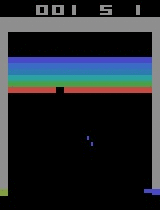

# DQN

Re implementation of original DQN paper for playing in atari environments. 
It contains trained models on the breakout environment (trained on 2M frames). 



## Requirements

- tensorflow
- gym
- cv2


## How to run

Runs the default environment breakout. 
```
python main.py 
```

You can add different arguments to run the agent:
```
python main.py --epsilon 0.1 --load True
```
Runs the agent using the pretrained model (trained on 2M frames) with epsilon 0.1. 

